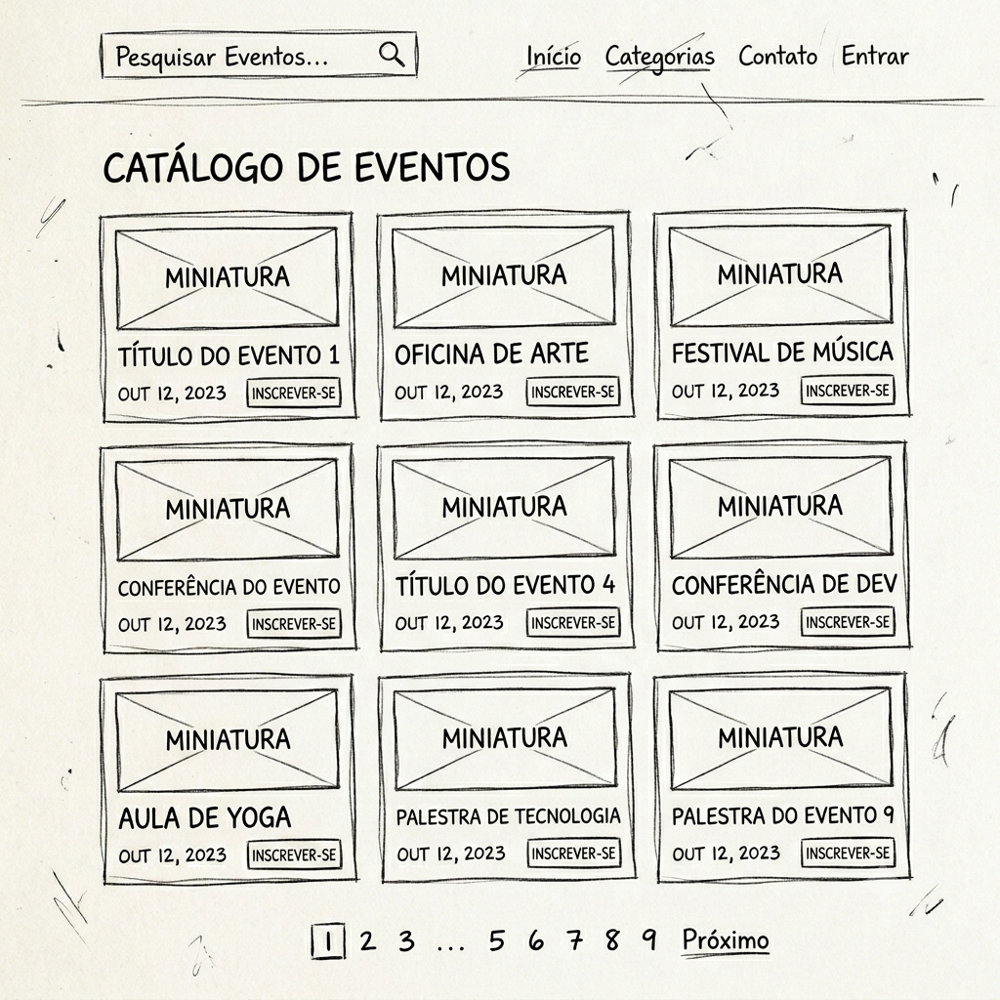

# Protótipos de Interface (Wireframes)

Este documento apresenta rascunhos visuais de **Baixa Fidelidade (Wireframes)**. 
O objetivo destes desenhos **não é aprovar a estética visual** do sistema, mas sim funcionar como uma ferramenta de comunicação, auxiliando a tomada de decisão e a resolução das lacunas críticas identificadas na revisão de requisitos.

---

## Tela 1: Finalização de Inscrição (Conflito de Horários)
**Ator:** Participante

**Contexto:** O usuário tenta finalizar a inscrição em um workshop que colide com o horário de outro evento onde ele já está confirmado.

> [!IMPORTANT]
> **Post-it de Proposta (Lacuna: Conflito de Horários):** 
> A UI permite o clique no botão "Continuar mesmo assim", sendo apenas um aviso.

> **Questão:** "Nós desenhamos a tela apenas com um aviso visual. Devemos manter essa permissão, ou o sistema deve bloquear totalmente a ação (sumir com o botão continuar) impedindo a dupla inscrição?"

---

## Tela 2: Painel do Participante (Regra de Cancelamento)
**Ator:** Participante

**Contexto:** Visualização das inscrições ativas no painel de usuário.

> [!TIP]
> **Post-it de Proposta (Regra RN01 e UI):** 
> Para eventos que não permitem cancelamento (como o Congresso de TI), o botão não desaparece da tela, ele fica visível porém bloqueado (com um cadeado).

> **Questão:** "Para evitar suporte técnico de participantes achando que o botão sumiu por erro no site, desenhamos o botão desabilitado. Vocês concordam com essa abordagem de usabilidade?"

---

## Tela 3: Catálogo de Eventos (Lista de Espera)
**Ator:** Participante / Organizador

**Contexto:** Um evento atinge a lotação máxima no sistema (Vagas = 0).

> [!WARNING]
> **Post-it de Proposta (Lacuna: Comportamento da Lista de Espera):** 
> O texto de apoio afirma a regra de notificação por e-mail e propõe um prazo fictício de 12 horas de SLA (tempo de resposta do usuário).

> **Questão:** "Propusemos aqui que a fila rodará a cada 12 horas e o aviso será via E-mail. Esse prazo faz sentido operacionalmente para a Eventus? Se não, qual o prazo exato que o sistema deve esperar?"

---

## Tela 4: Painel do Palestrante (Privacidade e LGPD)
**Ator:** Palestrante

**Contexto:** O palestrante acessa a lista para conhecer seu público antes da aula.

> [!CAUTION]
> **Post-it de Proposta (Lacuna: Privacidade dos Participantes / LGPD):** 
> Exibimos apenas o Nome e a Empresa do participante (omitindo telefone, CPF e e-mail).

> **Questão:** "Para blindar a empresa contra vazamento de dados (LGPD) através de palestrantes parceiros, nós cortamos a visualização do E-mail. O palestrante de vocês precisa enviar material direto para o participante? Se não, podemos aprovar essa tela restritiva?"

---

## Tela 5: Dashboard do Organizador (Visão Geral)
**Ator:** Organizador

**Contexto:** O organizador acessa o painel gerencial para visualizar a adesão de todos os eventos.

> [!TIP]
> **Post-it de Proposta (Monitoramento em Tempo Real):** 
> Um painel visual com contadores e gráficos simples para mostrar a ocupação das vagas.

> **Questão:** "Para atender ao requisito de acompanhamento em tempo real, propomos este layout focado nos números mais críticos (Vagas Livres vs Ocupadas). Falta alguma métrica gerencial de engajamento essencial aqui na tela inicial?"
